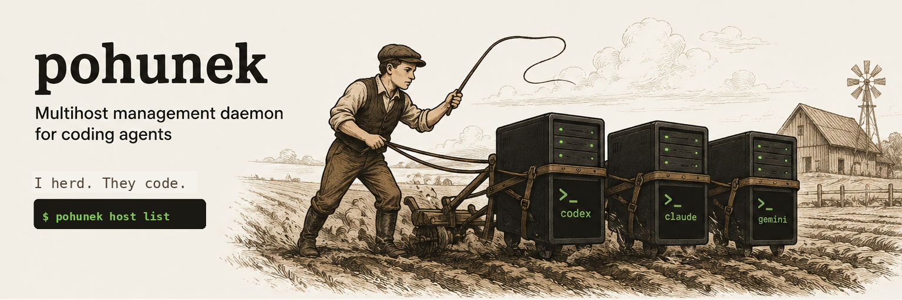

<p align="center">
  
</p>

<p align="center">
  <a href="https://github.com/zajca/pohunek/actions/workflows/ci.yml"></a>
  <a href="https://github.com/zajca/pohunek/releases/latest"></a>
  <a href="LICENSE"></a>
  
</p>

**pohunek** is a single-user control plane for durable coding-agent sessions
across your own machines. A Rust daemon (`pohunekd`) owns logical session state
and the public API on each host; one isolated `pohunek-sessiond` worker owns
each live PTY and agent process. The CLI (`pohunek`) drives the daemon locally
over a Unix socket and remotely over a NetBird/WireGuard mesh.

**The GUI is optional.** The daemon and its protocol are the product; every
client — the CLI, the bundled desktop GUI (`pohunek-gui`), your own launcher —
sits on top of the same versioned protocol. `pohunek-gui` ships as a reference
client, not a requirement: pohunek is fully usable from the CLI alone, and the
Rust/TypeScript SDKs exist precisely so you can **build your own GUI or client**
tailored to how you work. See [SDKs and building your own client](#sdks-and-building-your-own-client).

Start Codex, Claude Code, or Hermes Agent on any of your machines, detach, walk away, and
come back later — from any terminal, from a GUI, or from a keyboard
launcher. The agents keep working; pohunek keeps track of what they are doing,
where they are doing it, and when they need you.

> A *pohunek* is the farmhand boy who drives the draft animals. He does not
> plow himself — he keeps the team moving.

> **Status: pre-1.0, experimental.** Wire shapes, config files, and on-disk
> metadata may change freely between releases. Linux-first.

## Features

**Durable agent sessions**

- A dedicated worker owns every PTY, so sessions survive client detach,
  terminal crashes, daemon restart, daemon failure, and daemon binary upgrade.
  Attach from any terminal with `pohunek attach`, detach with `Ctrl-]`, and
  reattach later. Multiple clients can attach to one session.
- Codex, Claude Code, and Hermes Agent are first-class agents (plus plain
  `shell`), with
  per-host **agent profiles** that define the program, arguments, environment,
  and input rules for custom runtimes (e.g. `claude-otel`).
- Hermes Agent `0.20.0` is supported only through its local interactive terminal
  backend. Docker, SSH, browser, desktop, gateway, ACP, and other Hermes
  backends are outside Pohunek's PTY ownership model. The selected Hermes
  profile can additionally host the owner-private Pohunek operator plugin:
  bounded typed tools, a generated skill, and best-effort lifecycle hooks.
- **Live agent state detection** — `working` / `blocked` / `idle` — derived
  from OSC terminal titles, screen-content pattern matching, and PTY activity.
  Detection rules are TOML manifests, so new agents can be added without
  recompiling.
- **Native recovery**: hooks capture the launch agent's own session id, so a
  lost or terminal runtime can be recovered explicitly. Recovery creates a new
  PTY generation; ordinary daemon restart reconnects to the existing worker and
  never invokes provider-native resume.
- **Session fork** — branch a Claude Code conversation into a new session and
  PTY without disturbing the original.
- **Prompt injection done right**: `session input` and `--input` use per-agent
  framing (bracketed paste, delayed submit) so multi-line prompts actually
  submit into Ink/TUI agents instead of being half-swallowed.
- **Provider-neutral observation**: read a bounded rendered screen, page through
  retained binary-safe output with exact runtime cursors, or wait up to eight
  seconds for state/activity/output changes without taking attach ownership.
- Rename sessions, attach arbitrary `key=value` metadata, and inspect
  everything as JSON.

**Multi-host, no central server**

- Every command takes `--host <name>`; session targets accept
  `<host>/<session-id>`. The CLI talks **directly** to each host's daemon —
  there is no coordinator, no SaaS, no state sync.
- Remote transport is a TCP listener bound **only** to the host's
  NetBird/WireGuard address, never `0.0.0.0`. Reachability and encryption come
  from the mesh; local access is an owner-only Unix socket.
- **Tokenless discovery**: `pohunek host discover` enumerates local NetBird
  peers and probes which run a reachable daemon. It needs local NetBird but not
  local `pohunekd`, and uses a short owner-private cache; `--refresh` re-probes.
  Status loading and peer probing have explicit bounded deadlines.
  `host inspect` queries live capabilities straight from the selected daemon.
- **Shell completion**: generate static Bash, Zsh, or Fish completion from the
  clap command tree. An explicit `--dynamic` mode adds bounded, failure-silent
  host and session-target lookup without starting a daemon.

**Projects and worktree isolation**

- The daemon notices when a session starts inside a git repository and records
  a lightweight **project** (keyed by the canonical git common dir, so a repo
  and all its worktrees collapse into one project). No filesystem scanning.
- Start a session with `--branch` and the daemon creates a
  **worktree-per-session** off the base branch, so two agents never share a
  working tree by accident. Worktree ownership is recorded and checked before
  any reuse or cleanup.
- Per-project **actions and prompt templates**: an in-repo `.pohunek/`
  directory shadows host-level config, so `pohunek project action <ref> <name>`
  resolves a full launch recipe (agent, base branch, branch rule, rendered
  prompt) for launchers, the GUI, and scripts.
- `pohunek session diff` renders a unified diff of a session's worktree
  against its base — including untracked files — over the wire.

**Durable notification activity**

- Agent events (approval required, agent blocked, turn completed, session
  finished, errors) become **durable notification records** with lifecycle
  states (`unread → read → acknowledged → archived → deleted`).
- Fed by installed Codex/Claude hooks *and* daemon-side state projection, with
  source-priority dedupe, a debounce window that drops notifications the agent
  resolves itself, and resolve-on-resume so stale "blocked" entries disappear
  when the agent returns to working or its normal ready prompt.
- `pohunek notifications list|watch --all-hosts` fans out across every
  reachable host client-side. Per-kind/provider policy, automatic age retention,
  and physical JSONL compaction are daemon-enforced; unresolved actions and
  errors never expire automatically.

**Native desktop GUI (optional reference client)**

- `pohunek-gui` (Iced, Wayland) is a session-first control plane. Its main pane
  groups cross-host sessions as Needs you, Running, Ready, and Unavailable;
  unread history never promotes a ready session. The left rail keeps only
  Assistant, Activity, hosts, and project context.
- Clicking a session opens its detail in a modal over the list. Eligible rows
  expose direct Open/Resume, Terminate, and confirmed Delete actions.
- The **Activity** modal is a quiet, chronological cross-host history with
  Recent, Unread, and Archived views. Current approvals and blocked state are
  shown directly on session rows and in session detail; failed sessions carry a
  review signal without conflating unread history with live attention.
- It deliberately embeds **no terminal** — opening a session spawns your own
  terminal via a configurable `attach_command`. The native GUI has no
  Linear/GitHub browser, review, worktree-management, or Agents-monitor panel.

**Launcher and terminal UX**

- `pohunek setup` installs rofi/sway launcher scripts, default config, prompt
  templates, and an optional sway keybinding drop-in — start or switch to any
  session in two keystrokes.
- **Attach session menu**: raw terminal passthrough preserves native scrollback;
  `Ctrl-\` temporarily shows a one-row status banner with a composited menu
  (kill, detach, new session in the same worktree, fork, rename), then restores
  the agent screen and raw passthrough when the menu closes.
- Attach auto-reconnects after a daemon restart to the same worker, PTY, child
  PID, and runtime generation. Retries use a minimum interval and consecutive
  attempt cap, while typed worker-stream failures stop immediately. A changed
  runtime generation is shown as explicit native recovery, not seamless
  continuation.

**Built to be driven by agents, not just humans**

- Automation commands have a versioned `--json` process envelope with exactly
  one `ok` or `err` document on stdout; diagnostics stay on stderr. Errors are
  structured (`class`/`code`/`msg` plus a recovery hint), and `subscribe`
  streams typed events over the same protocol. Session creation and input can
  read bounded UTF-8 payloads from stdin so prompts do not need to appear in
  argv, diagnostics, or logs.
- **Universal assistant**: `pohunek assistant "how do I …"` launches a capable
  agent session preloaded with an offline knowledge bundle about pohunek
  itself and a redacted live snapshot of your hosts — self-hosted support for
  setup, project configuration, updates, and debugging.
- **SDKs — build your own GUI or client**: a Rust client crate
  (`pohunek-client`) and TypeScript packages (`@pohunek/protocol`,
  `@pohunek/sdk`, `@pohunek/backend`, `@pohunek/client-core`,
  `@pohunek/frontend`, and `@pohunek/testkit`) speak the same versioned
  newline-delimited JSON protocol the bundled GUI uses — nothing is private to
  `pohunek-gui`. Browsers use the node-free `@pohunek/sdk/browser` entry through
  the backend's WebSocket tunnels. TS protocol types are generated from the Rust
  source of truth. If the bundled clients do not fit your workflow, wire up your
  own control plane on these SDKs instead of forking one.

## How it works

```text
  CLI / GUI (local)                   CLI / GUI (remote)
       |                                   |
       | Unix socket                       | TCP over NetBird/WireGuard
       | ($XDG_RUNTIME_DIR, mode 0600)     | (daemon binds ONLY to the 100.x iface)
       v                                   v
 +-----------------------------------------------------------+
 |                    host daemon (pohunekd)                  |
 |  public protocol | logical state | reconciliation | mesh   |
 +-----------------------------------------------------------+
       |
       | owner-private local worker protocol
       v
 +-----------------------------------------------------------+
 | pohunek-session@s-01J00000000000000000000000.service (one worker per live session) |
 | PTY master | child process | output ring | terminal state  |
 +-----------------------------------------------------------+
       |
   Codex / Claude Code / Hermes Agent running in worker-owned PTYs
```

Each host is authoritative for its own sessions, projects, worktrees, and
notifications. Control traffic is newline-delimited JSON; attaching to a
session opens a **separate raw byte connection**, so JSON stays JSON and
terminal bytes stay bytes.

Durability is tiered and explicit: detach, client restart, daemon restart,
daemon crash, and daemon binary upgrade preserve the same live PTY and child
PID. A host reboot, user-manager shutdown, or worker failure loses that runtime
generation; the logical session remains visible as `runtime.state=lost` and may
be recovered explicitly when it has valid native recovery metadata.

## Install

Each release publishes `pohunek-cli-*` and `pohunek-daemon-*` archives for
x86_64 Linux with both glibc and MUSL. The native `pohunek-gui-*` archive is
published for glibc because its Wayland client and graphics stack are dynamic
runtime dependencies; there is no self-contained MUSL GUI archive. Every
archive contains its license and offline documentation under `docs/offline/`.
Daemon archives contain `pohunekd`, `pohunek-sessiond`, the daemon service, the
per-session worker template, the worker slice, and the installer.

Releases also publish `pohunek-web-*-linux-x86_64.tar.gz`: a standalone web
control-center backend with Bun embedded, its compiled SPA, and a user-service
installer. It runs beside a compatible local `pohunekd`; unpack it, run
`./install.sh`, configure the required NetBird bind address and port in
`~/.config/pohunek/backend.env`, then enable `pohunek-backend.service`. See the
archive's `README.md` for the complete commands.

Download from [Releases](https://github.com/zajca/pohunek/releases), unpack,
and put the binaries on your `PATH`.

Protocol v2 was a one-time coordinated pre-1.0 boundary. Before that M1
transition, every CLI, GUI, web backend/SDK, custom client, and local or remote
daemon had to cross together. The legacy integer-v1 envelope and fixed
`codex`/`claude` notification-policy fields have no compatibility shim. Once a
fleet is on v2, peers negotiate their highest overlap: M2 and this M3 plugin do
not raise the public protocol version or require a second coordinated boundary.
Do not binary-downgrade a host after it has persisted Hermes enum values or the
provider-keyed notification policy; recover by upgrading forward instead.

For the daemon component, run the included installer so the worker binary and
all systemd user units are installed together. The first upgrade from a legacy
daemon-owned PTY release refuses live sessions by default because those open
PTYs cannot be transferred. Let them finish; use `--accept-runtime-loss` only
after reviewing the affected ids and knowingly accepting the destructive
boundary. See the
[migration guide](docs/migrations/durable-session-workers.md) and
[operations runbook](docs/runbooks/durable-session-workers.md).

Or build from source (Rust 1.96+):

```bash
git clone https://github.com/zajca/pohunek.git
cd pohunek
cargo build --release --locked \
  --bin pohunek --bin pohunekd --bin pohunek-sessiond --bin pohunek-gui
```

## Quick start

```bash
# 1. Check the environment (binaries, socket paths, writable state dirs)
pohunek doctor

# 2. Start the host daemon in the background
pohunek daemon start --detach
pohunek health

# 3. Install agent hooks (native session-id capture + notifications)
pohunek integration install

# 4. Start an agent session and attach to it
pohunek session new --agent claude --name "fix-login-bug"
pohunek session list
pohunek attach <session-id>        # Ctrl-] detaches, the agent keeps running
```

For an isolated feature branch, let the daemon create a dedicated worktree:

```bash
pohunek session new --agent codex \
  --repo ~/Code/myapp --branch feat/retry-logic --base-branch main \
  --input "Add retry logic to the API client, then run the tests."
```

### Hermes Agent and operator plugin

Pohunek manages the local interactive Hermes terminal as `--agent hermes`. Before
launching, inspect the target host: the `hermes` runtime must be `available`
and report `version=0.20.0` with `supported=true`.

```bash
pohunek host inspect local --json
pohunek session new --agent hermes --name "investigate-login-bug"
```

Pohunek launches exactly `hermes chat`. A valid reported native Hermes reference
is resumed only as `hermes chat --resume <reference>`; it never uses
`--continue` or `--pass-session-id`. Hermes has no supported native fork, so a
fork request returns typed `agent_fork_unsupported` data before a worktree or
child session is created. Pohunek never reads Hermes `state.db`.

Install the operator plugin only into a target you name explicitly. The default
profile is valid only when stated as `--hermes-profile default`; named profiles
and a custom absolute home are isolated alternatives. The installer creates a
Pohunek-owned owner-private policy outside the plugin checksum set, and binds
its exact absolute path into the managed plugin asset.

```bash
# Observation plus constrained peer-session management in one named profile.
pohunek integration install --agent hermes --hermes-profile work \
  --access-mode manage --allow-host local --json

# A default profile must still be selected explicitly.
pohunek integration status --agent hermes --hermes-profile default --json
pohunek integration doctor --agent hermes --hermes-profile work --json

# A relocated profile must be an explicit absolute, owner-private target.
pohunek integration install --agent hermes \
  --hermes-home /absolute/private/hermes-home \
  --access-mode read_only --allow-host local --json
```

`read_only` registers observation tools; `manage` adds constrained session
management; `full` alone registers stop and remove. Remote host access is
restricted by the explicit allowlist and goes directly to that daemon over
NetBird, never through SSH. `*` needs `--confirm-wildcard`. Use
`integration update` for a version/policy refresh and `integration uninstall`
to remove only managed assets; add `--confirm-modified` when the ownership
check reports changed assets. `status`, `doctor`, `update`, and `uninstall` are
Hermes-only; Codex and Claude retain their existing `integration install`
behavior and receive a typed unsupported-action error for these lifecycle
actions.

The plugin is a delegated-tool guardrail, not a sandbox against a same-user
Hermes process with shell or file-write access. It repeats the daemon's exact
origin-session denial for `session.stop`, `session.resume`, `session.remove`,
`session.fork`, `session.resize`, `session.set_metadata`, `session.rename`, and
`session.input`. Only `session.report_agent`, `session.release_agent`, and
`session.report_native_id` remain lifecycle-report exceptions. Hooks use
bounded local reporting, never a subprocess, network connection, or Hermes
database; if they fail, turns remain usable and daemon process/screen detection
is the fallback.

Hermes programmatic input preserves multiline prompts with bracketed paste and
a separate submit. It accepts LF and tab, rejects other terminal control
characters without rewriting them, and refuses input while Hermes is visibly
waiting for owner approval.

## CLI guide

Every command accepts `--host <name>` (default `local`), and nearly all of
them `--json` for machine-readable output (the exceptions are `attach`,
`daemon start`, and `prompt render`). Session targets are `<session-id>` or
`<host>/<session-id>`.

| Command | What it does |
|---|---|
| `pohunek doctor` | Environment health: binaries, socket, state dirs, NetBird, agents. |
| `pohunek daemon start [--detach]` | Run the host daemon (foreground or background). |
| `pohunek health` / `status` | Daemon liveness, build, and protocol version. |
| `pohunek session new` | Start a session: `--agent`, `--name`, `--project`/`--repo`, `--branch`, `--base-branch`, `--cwd`, `--input`, `--request-timeout-ms`, `--meta k=v`. |
| `pohunek session list` | List sessions; `--filter state=running --filter agent=codex` (ANDed), `-q` for ids only. |
| `pohunek session inspect <target>` | Full logical session record: agent state, runtime state and generation, cwd, project, branch, worktree, recovery binding. |
| `pohunek attach <target>` | Attach the current terminal; `Ctrl-]` detaches. |
| `pohunek session input <target> <text>` | Inject a prompt with agent-correct framing; use `--stdin` for non-argv input. |
| `pohunek session screen <target>` | Read the current rendered terminal; `--json` preserves runtime identity, watermark, geometry, cursor, and visible lines. |
| `pohunek session output <target>` | Read a newest retained tail or continue with `--runtime-id`, `--runtime-generation`, and `--after-offset`; `--wait-ms` performs a bounded wait. |
| `pohunek session wait <target>` | Long-poll up to 8000 ms for explicit state, activity, metadata, terminal, output, or runtime predicates. |
| `pohunek session fork <target>` | Fork an agent conversation into a new session when that session advertises fork capability (currently Claude Code). |
| `pohunek session diff <target> [--base <ref>]` | Unified diff of the session's worktree vs its base. |
| `pohunek session rename / stop / rm` | Rename, stop, or evict a session. |
| `pohunek project add / list / show / rename / rm` | Manage git-repo-aware project records. |
| `pohunek project actions / action / prompt` | Resolve per-project launch recipes and prompt templates. |
| `pohunek host discover / list / inspect` | Find NetBird peers running daemons (standalone cache; `--refresh`) and query live capabilities. |
| `pohunek completions <bash\|zsh\|fish>` | Print static shell completion; add `--dynamic` for bounded host/session candidates. |
| `pohunek notifications list / watch` | Inspect or stream the durable inbox; `--all-hosts` fans out. |
| `pohunek notifications read / ack / archive / delete` | Drive one record's lifecycle (`host/id` targets a specific host). |
| `pohunek notifications policy / retention` | Per-kind/provider policy (including `hermes`), retention pruning (`--dry-run` / `--apply`). |
| `pohunek integration install` | Install Codex/Claude hooks, or a selected Hermes profile's managed plugin with explicit access mode and host allowlist. |
| `pohunek integration status / doctor / update / uninstall --agent hermes` | Inspect, diagnose, atomically refresh, or safely remove one explicitly selected Hermes plugin target. |
| `pohunek setup [scripts\|config\|sway]` | Install launcher scripts, default config + prompt templates, sway keybindings. |
| `pohunek setup completions <bash\|zsh\|fish>` | Install completion in the shell's conventional user directory; add `--dynamic` to opt in to runtime candidates. |
| `pohunek assistant [intent] [request…]` | Launch the self-help assistant with knowledge bundle + live snapshot. |
| `pohunek prompt render / link` | Render provider prompt templates and work-item link metadata (used by launchers). |

### Working across hosts

```bash
pohunek host discover                          # which NetBird peers run a daemon?
pohunek host inspect buildbox --json           # agents/worktree capabilities, live

pohunek session new --host buildbox --project myapp --agent codex \
  --branch feat/parser --input "Fix the parser fuzz failures."

pohunek session list --host buildbox
pohunek attach buildbox/s-01J00000000000000000000000 # raw PTY over the mesh

pohunek notifications watch --all-hosts        # one triage stream for every machine
```

Remote session starts ask for confirmation (skip with `--yes`); project
references resolve on the *target* host, so no filesystem path ever crosses
the wire.

### Shell completion

Print a static script for manual loading, or install it in the shell's
conventional per-user directory:

```bash
pohunek completions bash > pohunek.bash
pohunek setup completions zsh
pohunek setup completions fish --dynamic
```

Static completion performs no I/O beyond script generation. Dynamic completion
is opt-in: it reads the existing owner-private host-discovery cache and makes a
live, deadline-bounded `session.list` call for session targets. A qualified
`host/id` target overrides `--host`; otherwise an explicit `--host` selects the
session source and the default is local. Missing daemons, unavailable NetBird,
and timeouts produce no shell diagnostics or candidates. The setup command does
not edit shell startup files; for Zsh it prints the `fpath` step required before
`compinit`.

### Automation and bounded observation

Use stdin for prompts that must not appear in the process list. The creation
forms `--input` and `--input-stdin` (alias `--stdin`) are mutually exclusive;
`session input` likewise accepts either positional text or `--stdin`:

```bash
printf '%s' 'Review the failing test and propose a fix.' \
  | pohunek session new --agent codex --input-stdin --json

printf '%s' 'Run the focused tests.' \
  | pohunek session input s-01J00000000000000000000000 --stdin --json
```

Every `--json` success is one document shaped as
`{cli_version, protocol: {minimum, maximum}, ok}`; failures use the same prefix
with `err` instead of `ok` and exit non-zero. Human diagnostics remain on
stderr. Long counters such as `runtime_generation`, offsets, and watermarks are
decimal JSON strings.

Start observation with a screen or newest output tail, then carry the returned
runtime identity and cursor into later calls:

```bash
pohunek session screen s-01J00000000000000000000000 --json
pohunek session output s-01J00000000000000000000000 --max-bytes 65536 --json
pohunek session output s-01J00000000000000000000000 \
  --runtime-id runtime-1 --runtime-generation 3 --after-offset 4096 \
  --max-bytes 65536 --wait-ms 5000 --json
pohunek session wait s-01J00000000000000000000000 \
  --runtime-id runtime-1 --runtime-generation 3 --after-output-offset 4096 \
  --timeout-ms 8000 --json
```

Waiting output and `session wait` use dedicated connections. Re-issue short
waits as needed; a killed client does not promise immediate daemon-side waiter
cancellation, so the requested timeout is the release bound.

If `session output` returns a structured `gap`, retained history no longer
contains the requested range: discard that cursor and restart from a current
screen or newest tail. If it reports `session_runtime_changed`, discard the old
runtime identity and cursor before retrying. A `session wait` result with
`reason: "timeout"` is a bounded no-change outcome, not proof of idle or
health; a wake reports the changed runtime/session snapshot and watermark.

TypeScript clients running inside a managed session configure the atomic origin
pair explicitly; the SDK copies it to ordinary, subscription, and dedicated
observation connections and never reads `process.env`:

```ts
const client = await connectLocal(socketPath, {
  origin: { sessionId: "s-origin", daemonId: "daemon-origin" },
});
```

### Notifications triage

```bash
pohunek notifications list --unread
pohunek notifications ack buildbox/n-42
pohunek notifications policy set --provider claude --kind turn_completed --enabled
pohunek notifications policy set --provider hermes --kind agent_blocked --enabled
pohunek notifications retention prune --status archived --before 2026-06-01T00:00:00Z --apply
```

### Assistant

```bash
pohunek assistant "why does attach fail on my laptop?"
pohunek assistant setup                # steer toward host setup
pohunek assistant debug --host buildbox --no-snapshot
pohunek assistant --agent hermes "Explain the current session runtime."
```

The assistant is an ordinary agent session — the same PTY, attach, and
notification machinery — launched with a materialized offline knowledge
bundle and a redacted snapshot of live state. No secrets enter the prompt. Its
automatic preference order is `pohunek-assistant`, `codex`, `claude`, then
`hermes`; explicit Hermes selection still requires the supported runtime on the
selected host.

## GUI

`pohunek-gui` reads `~/.config/pohunek/gui.toml`:

```toml
pohunek_bin = "/usr/local/bin/pohunek"
attach_command = "$TERMINAL -e sh -c 'exec {bin} attach --host {host} {id}'"
notification_command = "notify-send"
```

Highlights: prioritized session groups, modal session detail, quick lifecycle
actions, `n` for Start session, `a` for Assistant, `i` for Activity, `o` to open
the selected session, and `shift+?` for the full keymap. Supported bindings are
remappable through `[keybindings]`. Wayland-only on Linux v1.

The bundled GUI is a **reference client**, not the only supported way in. It
uses the same public protocol and SDKs documented below — so if it does not fit
your workflow, the next section is your starting point for building your own.

## Web control center

The optional web control center serves one Svelte SPA for host and session
status, session lifecycle, live notifications, and in-browser terminal attach.
`@pohunek/backend` discovers daemons through its local `pohunekd` and exposes
the existing protocol as transparent WebSocket tunnels; it holds no
authoritative session state, and the CLI and native GUI remain independent.

The workspace is a persistent session-first shell. Its rail groups sessions by
project, promotes blocked work into an Attention section, searches and filters
across every host, and keeps compact host connectivity visible without making
hosts the primary navigation. Selecting a running session attaches its terminal
in the main pane while the rail remains available. Session metadata and stop
actions live in an inspector drawer; the terminal toolbar can rename, stop,
resume, fork, or permanently remove eligible sessions. Observed external
sessions remain read-only. New-session and Inbox flows are overlays, and opening
a session notification marks it read and selects its terminal.

A host-scoped Projects screen registers repositories by absolute daemon-host
path, renames or removes project records, shows live worktrees, and removes an
eligible Pohunek-owned worktree after explicit confirmation. The daemon remains
authoritative for worktree ownership, live-session, and pruning safeguards.

Keyboard controls are available outside form fields and terminals: `Ctrl+K`
opens the command palette, `Ctrl+B` toggles the session rail, `n` starts a
session, `i` opens the Inbox, `b` cycles blocked sessions, `/` focuses session
search, and `j`/`k` or the arrow keys move focus through the rail before
`Enter` opens the focused session. `Esc` closes the active overlay. Unmodified
shortcuts never intercept input inside the embedded terminal.

On mobile and short touch viewports, the session rail becomes an off-canvas
drawer so the terminal owns the screen. The terminal follows the visual
viewport when the software keyboard opens and provides a touch toolbar for
keyboard focus, Escape, Tab, one-shot Control and Alt modifiers, Control-C,
and the arrow keys. Mobile overlays use the full viewport, controls provide
44-pixel touch targets, and safe-area insets are respected in portrait and
landscape orientations.

For local UI development with two fixture daemons, run `bun run dev` from
`web/`; no Rust daemon or NetBird setup is required. Bun remains the workspace
runtime, while the development orchestrator requires `node` on `PATH` to run
Vite's WebSocket proxy in a compatible Node child process. Set
`POHUNEK_NODE_BIN` only when the Node executable has a nonstandard path. A
deployed backend binds only to a NetBird address (loopback requires the explicit
development flag; wildcard binds are rejected). The supplied systemd user unit
and its environment file instructions are in
`web/backend/systemd/pohunek-backend.service`.

## SDKs and building your own client

pohunek's real interface is its **protocol**, not any one client. `pohunek-gui`
is just one consumer of a versioned, newline-delimited JSON protocol that every
client speaks — and the same protocol and SDKs are available to you. You are
encouraged to **build your own GUI, TUI, launcher, or automation** on top of
them rather than being tied to the bundled app.

Nothing the GUI does is private to the GUI: it drives hosts, sessions,
projects, worktrees, notifications, diffs, and `subscribe` event streams
entirely through this surface.

- **Rust** — the `pohunek-client` crate: a typed `Client`, transports for local
  Unix sockets and NetBird/WireGuard TCP, raw attach helpers, typed
  `ClientError`s, and `subscribe` streams. It re-exports the `protocol` crate,
  the source of truth for every request, response, and event type.
- **TypeScript** — `@pohunek/protocol` (types generated from the Rust protocol),
  `@pohunek/sdk` (Bun/Node plus shared runtime), its browser-safe
  `@pohunek/sdk/browser` entry, `@pohunek/backend` (host discovery, static SPA,
  and transparent WebSocket tunnels), `@pohunek/client-core` (headless
  multi-host state), `@pohunek/frontend` (the Svelte SPA), and
  `@pohunek/testkit` (the stateful fixture daemon used by tests and dev mode).
- **Contract** — the wire surface is documented in
  [`docs/public-api.md`](docs/public-api.md); TS types are regenerated from
  Rust so the two SDKs never drift. The protocol is versioned, but pre-1.0 it
  may still change between releases (see the status note above).
- **Or skip a client entirely** — every CLI command supports `--json` and
  `subscribe` streams typed events, so a shell script is a legitimate way to
  drive pohunek.

Connecting and listing sessions is the same call in both SDKs:

```rust
// Rust — `pohunek-client`
use pohunek_client::{protocol::method::SessionList, Client};

#[tokio::main]
async fn main() -> anyhow::Result<()> {
    let sock = format!("{}/pohunek/daemon.sock", std::env::var("XDG_RUNTIME_DIR")?);
    // Local daemon over its owner-only Unix socket.
    let mut client = Client::connect_local(&sock).await?;
    // ...or a remote host over the NetBird/WireGuard mesh:
    // let mut client = Client::connect("workstation", &sock).await?;

    let sessions = client.call::<SessionList>(Default::default()).await?;
    for s in sessions {
        println!("{} {:?} {:?}", s.id.0, s.state, s.activity);
    }
    Ok(())
}
```

```ts
// TypeScript — `@pohunek/sdk`
import { connectLocal } from "@pohunek/sdk";

const sock = `${process.env.XDG_RUNTIME_DIR}/pohunek/daemon.sock`;
const client = await connectLocal(sock);

const sessions = await client.call("session.list", {});
for (const s of sessions) {
  console.log(s.id, s.state, s.activity);
}
await client.close();
```

Browsers use the node-free entry and reach a daemon through the backend origin:

```ts
import { Client } from "@pohunek/sdk/browser";

const client = await Client.connectWs(window.location.origin, "workstation");
```

Or subscribe to the same live event stream the CLI and GUI consume — session
lifecycle, agent state, and notifications, decoded into typed events:

```rust
// Rust — subscribe consumes the client and hands back an event stream.
use pohunek_client::{next_request_id, protocol::{method, Request}, Client};
use serde_json::Value;

#[tokio::main]
async fn main() -> anyhow::Result<()> {
    let sock = format!("{}/pohunek/daemon.sock", std::env::var("XDG_RUNTIME_DIR")?);
    let client = Client::connect_local(&sock).await?;

    let request = Request::new(next_request_id(method::SUBSCRIBE), method::SUBSCRIBE, Value::Null);
    let mut events = client.subscribe(&request).await?;
    // Runs until the daemon closes the stream.
    while let Some(ev) = events.next_event().await? {
        // `event` is the name (e.g. "agent_state"); `payload` is the flattened JSON body.
        println!("{}: {}", ev.event, ev.payload);
    }
    Ok(())
}
```

```ts
// TypeScript — same event stream.
import { connectLocal, nextRequestId } from "@pohunek/sdk";
import { PROTOCOL_VERSION } from "@pohunek/protocol";

const client = await connectLocal(sock);
const subscription = await client.subscribe({
  v: PROTOCOL_VERSION,
  id: nextRequestId("subscribe"),
  method: "subscribe",
  params: null,
});

for (let ev = await subscription.nextEvent(); ev !== null; ev = await subscription.nextEvent()) {
  console.log(ev.event, ev);
}
```

## Trust boundary

pohunek is built for **one operator on machines they own**:

- Local access control is owner-only socket and file permissions.
- Remote access control is your NetBird/WireGuard network and its policies;
  the daemon never binds a public interface.
- There is no multi-user auth, no hosted control plane, and no tenant model —
  by design, not omission.
- Secrets stay out of structured state: metadata, events, notifications,
  prompts, and logs are secret-free; provider tokens live in the OS keyring or
  provider CLIs (`gh`). Raw terminal scrollback is the one honest exception —
  it is stored owner-private.

## Development

The workspace is a Cargo monorepo (edition 2021, MSRV 1.96) plus a Bun
workspace in `web/` for the TypeScript packages.

| Crate | Role |
|-------|------|
| `crates/protocol` | Wire contract: envelopes, methods, events, version negotiation. |
| `crates/client` | Rust SDK: typed errors, transports, attach helpers. |
| `crates/daemon` | `pohunekd`: public control plane, logical session registry, reconciliation, detection, notifications. |
| `crates/worker-protocol` | Versioned owner-private daemon-to-worker protocol and framing. |
| `crates/session-worker` | `pohunek-sessiond`: one durable PTY runtime owner per live session. |
| `crates/cli` | `pohunek`: every command over the control protocol. |
| `crates/gui-core` | Headless GUI state + SDK bridge (no Iced; fully unit-testable). |
| `crates/gui` | Native Iced shell wrapping `gui-core`. |
| `crates/prompt` | Shared prompt rendering + `link.*` metadata schema (CLI, GUI, scripts). |
| `crates/knowledge` | Knowledge-bundle primitives for the assistant and offline docs. |
| `crates/terminal` | VT screen tracking and attach compositing. |
| `crates/netbird` | NetBird status parsing, host resolution, bind validation. |
| `crates/paths` / `crates/hostcheck` | XDG/socket contract; host environment probes. |
| `crates/xtask` | Workspace automation: docs build/check, TS type generation. |
| `web/` | `@pohunek/protocol`, `@pohunek/sdk`, `@pohunek/backend`, `@pohunek/client-core`, `@pohunek/frontend`, `@pohunek/testkit`. |

Read **[AGENTS.md](AGENTS.md)** first — it is the canonical contributor guide.
Authoritative design lives in [docs/architecture.md](docs/architecture.md);
the protocol contract in [docs/public-api.md](docs/public-api.md).

### Gates

CI treats warnings as errors. Run the full set before calling anything done:

```bash
cargo fmt --all --check
cargo clippy --workspace --all-targets --all-features
cargo test --workspace --all-features
cargo build --workspace --release
cargo xtask docs check          # knowledge bundle: schema/drift/secrets/runbooks
```

Web workspace:

```bash
cd web
bun install --frozen-lockfile
bun run typecheck && bun run lint && bun test
```

A protocol change is not done until the generated TypeScript types match:

```bash
cargo xtask ts generate   # regenerate web/shared/src/generated/**
cargo xtask ts check      # CI gate
```

### Conventions that matter here

- **Rust guidelines are mandatory.** The Microsoft Pragmatic Rust Guidelines
  are vendored at `.agents/rust-guidelines/`; read the relevant files before
  touching any `.rs` file (`SKILL.md` is the index).
- **Typed errors** (`thiserror`) per crate; no bare catch-alls. Library crates
  `#![forbid(unsafe_code)]`.
- **Config fails fast** — required values are validated at load; no silent
  defaults. No hardcoded magic values.
- **Secrets never enter code, logs, errors, or agent context.** Keyring
  references only; `gh` output is redacted before it can reach an error.
- **Protocol ripples**: touching `crates/protocol` means updating `client`,
  `daemon`, `cli`, `gui-core`, the generated TS types, `docs/public-api.md`,
  and the `docs/knowledge/` bundle in the same change.
- **Tests for all new logic**; the protocol and state machines have rich
  suites — extend them.

### Release

`scripts/release` bumps the workspace version, tags `vX.Y.Z`, and pushes; the
Release workflow re-runs the gates on the tag, then builds and publishes glibc
and MUSL x86_64 CLI and daemon archives, a glibc x86_64 GUI archive, and a
self-contained Linux x86_64 web-control-center archive. The offline docs are
bundled into every native component archive. CLI archives also contain
`packaging/smoke-hermes-plugin-release`. Release automation provisions the
source-locked Hermes runtime without provider credentials, runs the model-free
compatibility gate, extracts each CLI archive, and executes its packaged smoke
script against the extracted `pohunek` binary. Operators can repeat the same
script with an explicitly supplied, preinstalled pinned Hermes executable. It
creates an isolated temporary profile/state, requires that executable rather
than downloading it, and fails if install, status, doctor, or uninstall cannot
prove the embedded plugin and generated skill.

## License

[MIT](LICENSE). The embedded Pohunek Hermes plugin and generated skill are
repository-owned MIT assets. Their Python modules use only the Python standard
library plus the pinned Hermes host API; Pohunek does not bundle Hermes code,
marks, model/provider SDKs, or third-party Python dependencies in the CLI
archive.
