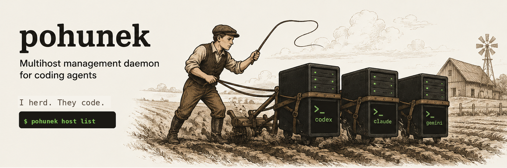

<p align="center">
  
</p>

<p align="center">
  <a href="https://github.com/zajca/pohunek/actions/workflows/ci.yml"></a>
  <a href="https://github.com/zajca/pohunek/releases/latest"></a>
  <a href="LICENSE"></a>
  
</p>

**pohunek** is a headless, multihost backbone for coding agents. One small Rust
daemon runs on every machine you own. Each Codex, Claude Code, or Hermes Agent
session gets its own durable terminal that survives detach, terminal and daemon
crashes, and daemon upgrades. The daemon exposes sessions, live agent state, worktrees, and
notifications through one versioned protocol, a JSON CLI, and Rust and
TypeScript SDKs.

> A *pohunek* is the farmhand boy who drives the draft animals. He does not
> plow himself — he keeps the team moving.

The agents do the plowing. pohunek keeps them running on the right machine, in
the right worktree, and tells you or your tooling when one of them needs
attention.

> **Status: pre-1.0, experimental.** Wire shapes, config files, and on-disk
> metadata may change freely between releases. Linux-first.

## What pohunek is for

- **Headless by design.** This repository ships no user interface. The daemon,
  its protocol, the CLI with `--json`, and the SDKs are the product. Every GUI,
  launcher, or dashboard is a client of the same public contract.
- **A stable base for tooling you build yourself.** Each agent CLI has its own
  TUI quirks, prompt framing, hooks, session ids, and resume and fork rules.
  pohunek handles those differences once: durable PTYs, per-agent input
  framing, live `working` / `blocked` / `idle` detection, native session
  recovery, and hook-fed notifications. Your scripts, launchers, review bots,
  and manager agents then talk to one contract and never integrate each agent
  CLI and harness themselves.
- **Multihost from the start.** Every host is authoritative for its own
  sessions. The CLI and SDKs talk directly to each host's daemon, locally over
  an owner-only Unix socket and remotely over a NetBird/WireGuard overlay. There
  is no central server, no SaaS, and no state sync. `--host buildbox` or a
  `buildbox/<session-id>` target is all it takes to work on another machine.
- **Driven by agents, not only by people.** Every automation command returns one
  versioned JSON envelope with typed errors. `pohunek agent-skill` prints the
  complete operating skill an agent needs, and `pohunek assistant` starts an
  agent session that already knows pohunek and your hosts.

```text
        your tooling: agents, scripts, launchers, GUIs, dashboards
                 |  pohunek CLI --json  ·  protocol  ·  SDKs
     +-----------+---------------+---------------------+
     | Unix socket               | NetBird/WireGuard   | NetBird/WireGuard
     v                           v                     v
  laptop: pohunekd         workstation: pohunekd    buildbox: pohunekd
     |                           |                     |
  durable PTY workers      durable PTY workers      durable PTY workers
  claude · codex           codex · hermes           claude · shell
```

[Features and architecture overview](docs/features.md) lists everything the
core does, explains the daemon/worker split, and describes the single-owner
trust boundary.

## Install with an agent

The easiest way to install pohunek is to let the coding agent you already use
do it. Open Claude Code, Codex, or another agent with shell access on the
machine that should become a pohunek host, and paste:

```text
Install pohunek (https://github.com/zajca/pohunek) on this machine and set it up
so you can drive it.

Read these first and follow them, they are the source of truth:
- https://raw.githubusercontent.com/zajca/pohunek/main/docs/install.md
- https://raw.githubusercontent.com/zajca/pohunek/main/docs/knowledge/guides/setup.md
- on macOS also https://raw.githubusercontent.com/zajca/pohunek/main/docs/knowledge/runbooks/install-on-macos.md

Rules:
1. Detect the OS and CPU. Linux x86_64 uses the latest release's
   pohunek-daemon-<version>-x86_64-unknown-linux-gnu.tar.gz (or -musl).
   macOS 14+ on Apple Silicon uses `brew install zajca/pohunek/pohunek`;
   tell me that macOS support is not declared final yet. For anything else,
   stop and tell me.
2. Verify every download with its .sha256 file and, when `gh` is available,
   `gh attestation verify <file> --repo zajca/pohunek`. Stop on any mismatch.
3. Before changing anything, run `pohunek service check --json` (from the
   extracted archive on Linux), show me what will be installed where, and wait
   for my approval. Then install the login service (`./packaging/install-daemon.sh`
   on Linux, `pohunek service install` on macOS). Never pass
   --accept-runtime-loss, --stop-sessions, or --purge.
4. Verify with `pohunek doctor --json`, `pohunek service status --json`,
   `pohunek health --json`, and `pohunek host inspect local --json`. Report
   every warning; fix only what I approve.
5. Ask me before running `pohunek integration install`: it has no dry run and
   installs a SessionStart hook into the Claude Code and Codex configuration of
   every agent present (`--agent` limits it to one). Tell me which agents and
   configuration files it will touch and wait for my approval.
6. Run `pohunek agent-skill` and save its output as a skill or instruction file
   in your own harness, so later sessions know how to drive pohunek. Tell me
   where you saved it.
7. If this machine is in a NetBird network, run
   `pohunek host discover --refresh --json` and list the hosts that already run
   pohunek.
8. Never put secrets into commands, logs, or your summary. End with the
   installed version, paths, open warnings, and next steps.
```

Repeat it on every machine that should host sessions. Each host needs its own
daemon, and remote hosts must be members of the same NetBird network. Once the
daemon runs, `pohunek assistant setup` starts an agent session with the offline
knowledge bundle and a redacted snapshot of your hosts. Use it to finish
projects, agent profiles, and remote hosts.

## Install manually

- **Linux x86_64:** each [release](https://github.com/zajca/pohunek/releases)
  publishes glibc and MUSL CLI and daemon archives. Unpack the daemon archive
  and run `./packaging/install-daemon.sh`.
- **macOS (Apple Silicon, macOS 14+):** `brew install zajca/pohunek/pohunek`,
  then `pohunek service install`. The archives are published, but macOS support
  is declared only after its acceptance gate
  ([#105](https://github.com/zajca/pohunek/issues/105)) passes.
- **From source (Rust 1.96+):**
  `cargo build --release --locked --bin pohunek --bin pohunekd --bin pohunek-sessiond`.

```bash
pohunek doctor                              # environment check
pohunek service status && pohunek health    # daemon installed and answering
pohunek integration install                 # Codex/Claude hooks: session ids + notifications
pohunek session new --agent claude --name "fix-login-bug"
pohunek attach <session-id>                 # Ctrl-] detaches, the agent keeps running
```

[docs/install.md](docs/install.md) has the full procedure: archive
verification, what the login service installs, upgrades from older releases,
and the first worktree-isolated session.

## Experiments built on pohunek

[`zajca/pohunek-work`](https://github.com/zajca/pohunek-work) holds the author's
own tooling on top of the core. It is also the test that the core works as a
backbone. Every surface there uses only public contracts: the CLI with
`--json` and the public protocol through the SDKs, pinned to one core release
and moving in lockstep with the protocol version. These surfaces are
experiments. They show one way to build on pohunek, not the way.

- **`pohunek-work` workflow plugin.** It answers one question for every open
  work item: who acts next, me, an agent, or a reviewer? It joins Linear or
  GitHub Issues, GitHub pull request state, and pohunek sessions into one table
  with a derived `on_turn` column. Named actions (`implement`, `babysit`,
  `fix-ci`, `rebase`, `review`, `ready`, `attach`) launch linked agent sessions
  in fresh worktrees. Merging stays manual. The plugin is also the first step
  toward a managing agent that runs these actions under an explicit owner
  policy.
- **Native GUI** (`pohunek-gui`, Iced). A session-first desktop control plane
  for Linux (Wayland) and macOS. It embeds no terminal: opening a session
  launches your own terminal.
- **Web control center.** A Bun backend with transparent protocol tunnels, plus
  a Svelte SPA with an in-browser terminal. It works from a phone over the mesh.
- **Launchers.** rofi and sway scripts, plus Linear and GitHub issue pickers
  that start or switch to a session in two keystrokes.

The core never learns about Linear, GitHub, or work items. It knows sessions,
worktrees, projects, events, notifications, and opaque metadata, and leaves
everything domain-specific to clients like these.

## Roadmap

A sketch of the main tracks. The
[GitHub Projects](https://github.com/zajca?tab=projects) and the linked epics are
the source of truth for scope, order, and status.

| Track | Where it is heading | Status |
|---|---|---|
| **Runtime plugin packages** — [#139](https://github.com/zajca/pohunek/issues/139), [project](https://github.com/users/zajca/projects/5) | Codex, Claude Code, and Hermes become signed, content-addressed runtime packages installed per host, with their own CI and compatibility matrix. Only `shell` stays built in. | In progress: the runtime registry, the package archive format, the signed catalog, and the content-addressed package store have landed; the CLI lifecycle and the three extractions are next. |
| **Workflow plugins** — [#148](https://github.com/zajca/pohunek/issues/148), [#325](https://github.com/zajca/pohunek/issues/325), [#326](https://github.com/zajca/pohunek/issues/326) | Bounded out-of-process plugins with declared actions and event reactions, invoked from the CLI. This is the packaging path for `pohunek-work`-style tooling. | Planned |
| **More agents** — [#50](https://github.com/zajca/pohunek/issues/50), [#227](https://github.com/zajca/pohunek/issues/227) | Pi and OpenCode 2.x as further first-class runtimes. | Planned |
| **Delegated task runs** — [#182](https://github.com/zajca/pohunek/issues/182), [WS1–WS8](https://github.com/zajca/pohunek/issues/219) | Tasks and turns over ordinary sessions: causal turn settlement, a blocking `task.wait`, typed results with repository evidence and checks, and an optional MCP adapter. Agents can then delegate work to other agents reliably. | Design: the RFC is being revised |
| **Durability and detection** — [#420–#426](https://github.com/zajca/pohunek/issues/426), [#59–#67](https://github.com/zajca/pohunek/issues/67) | Recovery from crashes and host-wide session loss in one action, and explainable, arbitrated `working` / `blocked` / `idle` detection. | Planned |
| **macOS** — [#94](https://github.com/zajca/pohunek/issues/94), [project](https://github.com/users/zajca/projects/4) | Native Apple Silicon hosts with launchd-owned durable workers. | In progress: archives and a Homebrew tap ship; support is declared after [#105](https://github.com/zajca/pohunek/issues/105). |
| **Optional team relay** — [#56](https://github.com/zajca/pohunek/issues/56), [project](https://github.com/users/zajca/projects/2) | A public, multi-team control plane: hosts open the WireGuard link to the relay themselves, and the relay adds team ACLs, routing, and audit. The direct owner path stays first-class, and the relay is to move to its own repository ([#417](https://github.com/zajca/pohunek/issues/417)). | Foundation (authentication, credentials) implemented; transport and team surfaces pending |
| **Dark factory** — [#185](https://github.com/zajca/pohunek/issues/185), [FS0–FS8](https://github.com/zajca/pohunek/issues/233) | Unattended manager/auditor delegation over the team relay, built as a client of the relay. | Design |

The longer narrative and the shipped foundations are in
[docs/ROADMAP.md](docs/ROADMAP.md).

## Documentation

| Document | Content |
|---|---|
| [Features and architecture](docs/features.md) | Everything the core does, the daemon/worker split, and the trust boundary |
| [Manual installation](docs/install.md) | Release archives, login service, upgrades, building from source, and a first session |
| [CLI guide](docs/cli.md) | Every command, multihost targeting, automation and observation, notifications, the assistant, and Hermes |
| [SDKs and your own client](docs/sdk.md) | Rust and TypeScript SDKs, connection, and event subscription examples |
| [Development](docs/development.md) | Workspace layout, gates, fast test loops, and release |
| [Knowledge guides](docs/knowledge/index.md) | Setup, remote hosts, project setup, agent skill, Hermes operator, and runbooks |
| [Public API](docs/public-api.md) | The versioned wire protocol |
| [Architecture](docs/architecture.md) | The authoritative design |

Contributors start with [AGENTS.md](AGENTS.md).

## License

[MIT](LICENSE). The embedded Pohunek Hermes plugin and generated skill are
repository-owned MIT assets. Their Python modules use only the Python standard
library plus the pinned Hermes host API; Pohunek does not bundle Hermes code,
marks, model/provider SDKs, or third-party Python dependencies in the CLI
archive.
